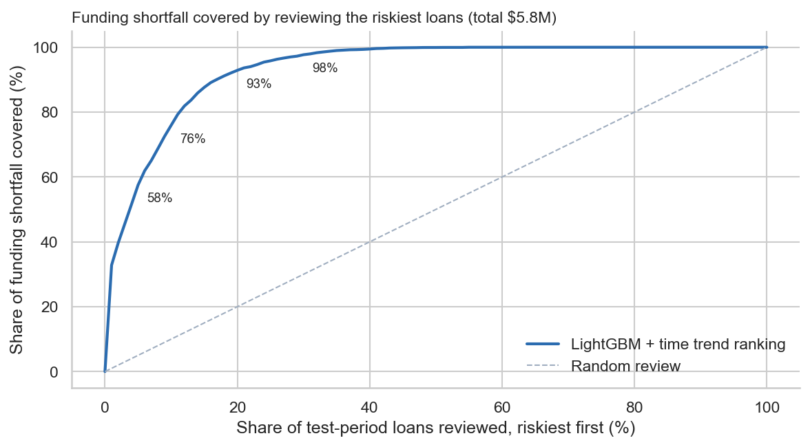
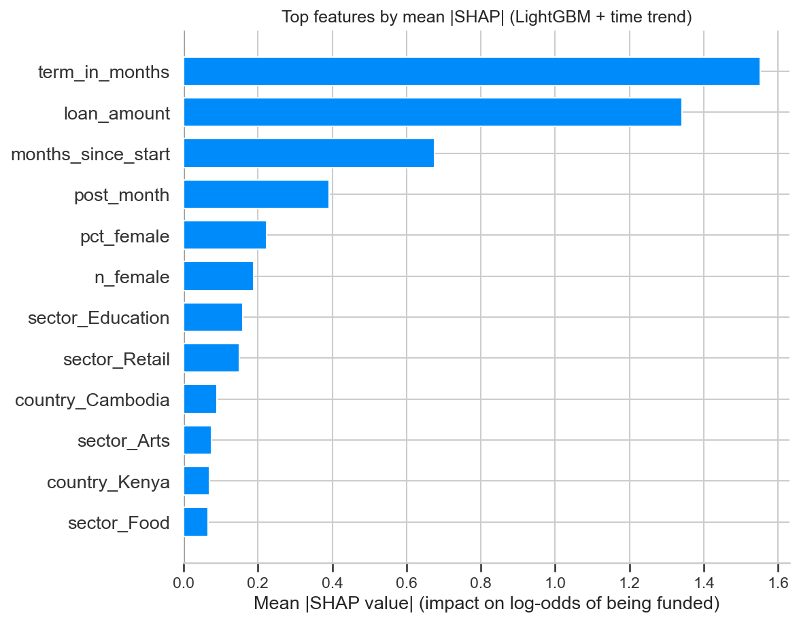
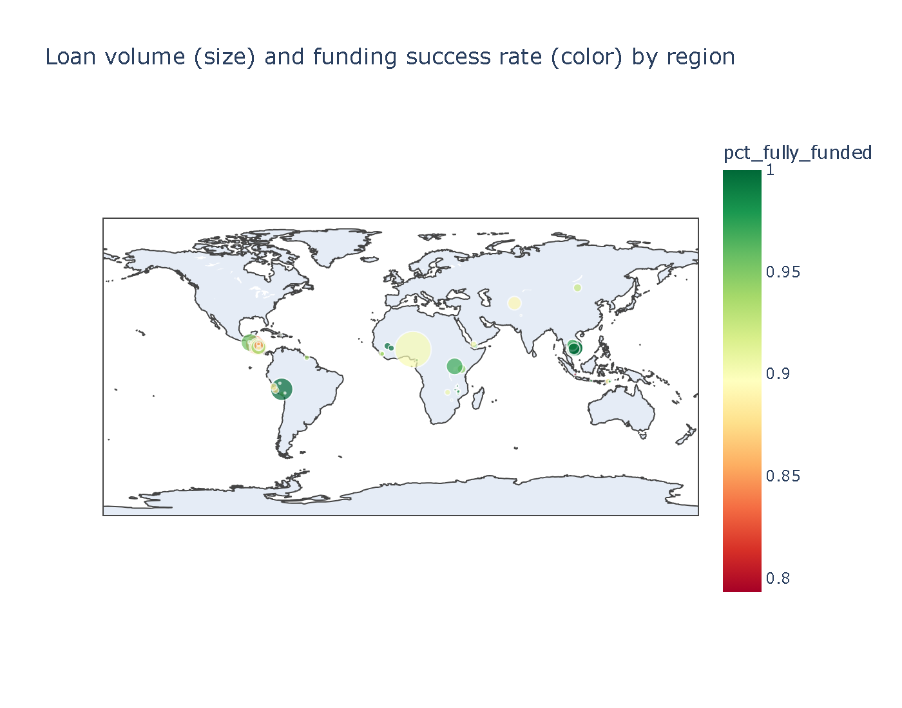
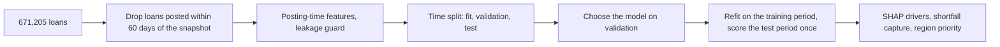

# Kiva Loans Microfinance Analytics

A model that warns, on the day a microloan is posted, that it may never be fully funded, so a platform can step
in early. On the most recent 129,017 loans, reviewing just the 10% it ranks riskiest would **reach 76% of the
$5.8M that went unfunded**. LightGBM on 671,205 Kiva loans (**PR-AUC 0.374** against a 4.6% base rate of
unfunded loans).

[](LICENSE)
[](#reproduce)
[](https://github.com/alvenyuka/Kiva-Loans-Microfinance-Analytics/actions/workflows/ci.yml)



## The questions, and the short answers

On Kiva, microfinance field partners post loans for small borrowers and lenders fund them in small amounts.
About 6% of loans with a known outcome never reach full funding. For the borrower that can mean a missed
planting season or lost stock; for the field partner, a loan it has to cover or cancel. A platform or impact
funder has limited levers (featuring a loan, adding matching funds, working with the partner on terms) and
cannot apply them to every loan. The project asks:

| Question | Short answer |
|---|---|
| Can the loans that will fall short be identified when they are posted? | Yes, well enough to prioritise: the riskiest 10% of new loans hold 76% of the unfunded dollars |
| Does that risk fall hardest on the poorest regions? | No. Across provinces holding 70.6% of settled loans the link is weak, and both the poorest and the least poor fifth are funded less often than the middle |

## Which loans are at risk when they are posted?

Every candidate was chosen on a validation period and scored once on the 129,017 most recently posted loans,
5,957 of them not funded. PR-AUC is for the at-risk class, whose base rate is 4.6%.

| Model | Validation PR-AUC | Test PR-AUC | Test ROC-AUC |
|---|---:|---:|---:|
| **LightGBM + time trend (chosen)** | **0.490** | **0.374** | 0.920 |
| LightGBM | 0.486 | 0.386 | |
| Random forest | 0.395 | 0.286 | |
| Logistic regression | 0.329 | 0.237 | |

The chosen model was picked on validation only. Plain LightGBM scores higher on the test period, but choosing it
for that reason would turn the test set into a second validation set, so the published figure is 0.374. At the
default score threshold the chosen model catches 86% of at-risk loans with 19% precision.

**Is the score stable over time?** A walk-forward test retrains the chosen model before each of four later
windows of 64,508 loans and scores the next window. At-risk PR-AUC runs from 0.394 to 0.503, always 4.8 to 14.3
times what random ranking would score, as the unfunded share falls from 8.3% to 2.9%. The published 0.374, from
a single model scored on the last two windows together, is at the cautious end.



**What drives the risk.** Loan structure: term and amount rank well ahead of borrower gender mix, sector and
country, which points to terms that field partners can adjust. The time trend and posting month come next.

**How long funded loans take.** A days-to-fund regression on funded loans has a mean absolute error of 7.0 days,
against 8.1 days for a naive forecast that gives every loan the training-period median.

## What a platform could do with it

The test period's loans fell $5,797,550 short of full funding in total. Reviewing loans in order of predicted
risk reaches most of that shortfall early:

| Loans reviewed, riskiest first | Loans | Shortfall reached | Share of shortfall | Unfunded loans reached |
|---|---:|---:|---:|---:|
| 5% | 6,451 | $3,334,700 | 58% | 40% |
| **10%** | **12,902** | **$4,402,525** | **76%** | **62%** |
| 20% | 25,803 | $5,384,850 | 93% | 85% |
| 30% | 38,705 | $5,664,000 | 98% | 95% |

Random review of 10% of loans would reach about 10% of the shortfall; the model's ranking reaches 76%. The
riskiest 10% hold 76% of the unfunded dollars but 62% of the unfunded loans, so the biggest gaps come first. The
loans flagged at the default threshold (20.5% of the test period) account for 93.2% of the shortfall. For a
platform with a fixed budget for featuring or matching funds, this turns an unmanageable queue into a short list.

## Does the risk fall hardest on the poorest regions?

No, and the wider data changes the shape of the answer.

**The first test was too narrow.** Matching each loan's region name to Kiva's regional Multidimensional Poverty
Index directly works for only 7.6% of loans, because loans name towns ("Lahore", "Kisii") while the index is by
province. On those few loans, across 75 regions, poorer regions were funded slightly more often (correlation
0.303; rank correlation 0.375), but that rests on 7.5% of settled loans.

**Kiva's own region link widens it to most of the data.** Kiva publishes a link from loan regions to
poverty-index provinces (`loan_themes_by_region.csv`). Through it, 70.9% of loans get a poverty score. Across 240
provinces in 47 countries, holding 70.6% of settled loans, the straight-line link between poverty and funding is
weak (correlation 0.081; rank correlation 0.121), and the shape is not a line:

| Poverty of the borrower's province | Least poor fifth | Second | Middle | Fourth | Poorest fifth |
|---|---:|---:|---:|---:|---:|
| Loans fully funded | 92.1% | 97.1% | 96.2% | 95.8% | 93.0% |

Funding risk is somewhat higher at both ends, not concentrated on the poorest. The link is approximate (Kiva
assigned it by nearest point), and the comparison is between provinces, not borrowers.



**It does not help the risk model either.** Swapping the wider poverty score into the model was tested under a
rule fixed beforehand (adopt only for a clear gain in validation PR-AUC, recorded in `outputs/results.json`); it fell slightly, from 0.4902 to
0.4880, so the model keeps the exact-join score. Within the exactly matched loans, regions in Timor-Leste,
Nigeria and Guatemala combine deep poverty with the highest predicted funding risk on a rank-based priority
index, which shows the method rather than a targeting list.

## How the answers were built

[Data Science for Good: Kiva Crowdfunding](https://www.kaggle.com/datasets/kiva/data-science-for-good-kiva-crowdfunding)
(Kaggle), joined to Kiva's regional Multidimensional Poverty Index (MPI).

| Data | Value |
|---|---:|
| Loans | 671,205 |
| Snapshot ends | 26 Jul 2017 |
| Loans with a settled outcome (posted over 60 days before the snapshot) | 645,083 |
| Not fully funded, settled loans | 6.4% |
| Training period (posted up to 27 Oct 2016) | 516,066 loans |
| of which validation slice (posted after 23 Apr 2016) | 103,213 loans, 9.6% not funded |
| Test period (posted after 27 Oct 2016) | 129,017 loans, 4.6% not funded |
| Loans matched to a regional poverty score | 50,955 (7.6%) |



1. **Settled outcomes only.** The funded rate falls from 94% to 16% for loans posted in the snapshot's final
   week, because they were still fundraising. Loans posted within 60 days of the snapshot (3.9%) are excluded.
2. **Posting-time features.** Loan amount and term, repayment schedule, sector, country, borrower gender mix,
   posting month and day, the regional poverty score with a flag for loans that have none, and terms from each
   loan's stated purpose (TF-IDF). Funded time, lender count and funded amount exist only because a loan was
   funded, so a tested guard keeps them out, before and after encoding.
3. **Out-of-time model choice and test.** The training period is split again by date. Four candidates are fitted
   on its earlier part and compared on the latest part, the validation slice: logistic regression, random
   forest, LightGBM, and LightGBM with a time-trend column. The winner is refitted on the whole training period
   and scored once on later loans. Text vocabulary and missing-value medians are fitted only on the loans each
   stage trains on.
4. **Judged on the minority class**, since the funded majority scores well whatever the model does.
5. **Shortfall capture.** Rank test-period loans by predicted risk and measure the funding shortfall (requested
   minus funded, in US dollars) reached by reviewing the riskiest share first (`src/impact.py`).

The notebook [`Kiva_Loans_Microfinance_Analytics.ipynb`](Kiva_Loans_Microfinance_Analytics.ipynb) follows the
same questions: what the data can support, which loans are at risk, and whether the risk falls on the poorest
regions, with a baseline before every model and checks that stop the run at any step that goes wrong.

## What the results cannot show

- **Correlational only.** Nothing here shows that a factor causes funding success, and the poverty link is
  measured across provinces, not individual borrowers, through a link Kiva assigned by nearest point.
- **Model choice rests on one validation slice.** The validation slice had a higher unfunded share (9.6%) than
  the test period (4.6%), and the two LightGBM candidates swap order between them. The walk-forward test shows
  the chosen model's score holds across later windows; it does not re-run the choice in each window.
- **Scores rank, they are not probabilities.** Balanced class weights move every score towards 0.5, so region
  priority uses ranks rather than multiplying scores by poverty.
- **Days-to-fund is truncated.** Recent loans that were still raising money at the snapshot have no
  days-to-fund value, so the test target leans towards quick fundraising.
- **Residual censoring.** A few loans older than 60 days at the snapshot may still have been fundraising.
- **Shortfall is not loss.** It measures money borrowers did not receive through Kiva, not a financial loss to
  the platform.

## Reproduce

```bash
pip install -r requirements.txt
python -m pytest              # no dataset needed
# put kiva_loans.csv and kiva_mpi_region_locations.csv in ./data (or set KIVA_DATA_DIR)
python build_notebook.py
jupyter nbconvert --to notebook --execute Kiva_Loans_Microfinance_Analytics.ipynb --output Kiva_Loans_Microfinance_Analytics.ipynb --ExecutePreprocessor.timeout=3600
```

The last recorded run took 38 minutes and peaked at 5.0 GB of memory.

```
Kiva_Loans_Microfinance_Analytics.ipynb   the analysis, organised around the two questions, executed end to end
build_notebook.py                         generates the notebook (edit this, not the .ipynb)
src/features.py                           leakage guard, funding target, gender parsing
src/impact.py                             funding-shortfall capture
outputs/results.json                      every headline number, package versions, git commit
tests/                                    tests for the logic the results rest on, and for this README
figs/                                     shortfall capture, SHAP drivers, funding-vs-poverty map
docs/METHODOLOGY.md                       full method, every result, limitations
```

The full method, every result and the tests are described in [`docs/METHODOLOGY.md`](docs/METHODOLOGY.md).

## License

MIT. See [`LICENSE`](LICENSE). Data: [Data Science for Good: Kiva Crowdfunding](https://www.kaggle.com/datasets/kiva/data-science-for-good-kiva-crowdfunding) (Kaggle).

Alven Yuka · [LinkedIn](https://www.linkedin.com/in/alven-yuka-610b78174/) · [Email](mailto:alvenyuka2@gmail.com)
