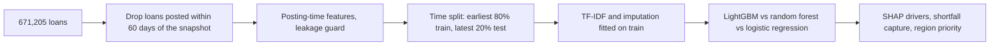

# Kiva Loans Microfinance Analytics

A model that warns, on the day a microloan is posted, that it may never be fully funded, so a platform can step
in early. On the most recent 129,017 loans, reviewing just the 10% it ranks riskiest would **reach 77% of the
$5.8M that went unfunded**. LightGBM on 671,205 Kiva loans (**PR-AUC 0.389** against a 4.6% base rate of
unfunded loans).

[](LICENSE)
[](#how-to-run)
[](https://github.com/alvenyuka/Kiva-Loans-Microfinance-Analytics/actions/workflows/ci.yml)


## Contents

1. [Business problem](#business-problem)
2. [Dataset](#dataset)
3. [Methodology](#methodology)
4. [Results](#results)
5. [Business impact](#business-impact)
6. [Key insights](#key-insights)
7. [Limitations](#limitations)
8. [Repository structure](#repository-structure)
9. [How to run](#how-to-run)

## Business problem

On Kiva, microfinance field partners post loans for small borrowers and lenders fund them in small amounts.
About 6% of loans with a known outcome never reach full funding. For the borrower that can mean a missed
planting season or lost stock; for the field partner, a loan it has to cover or cancel.

A platform or impact funder has limited levers (featuring a loan, adding matching funds, working with the
partner on terms) and cannot apply them to every loan. The question is whether the loans that will fall short
can be identified when they are posted, and whether that risk falls hardest on the poorest regions.

## Dataset

[Data Science for Good: Kiva Crowdfunding](https://www.kaggle.com/datasets/kiva/data-science-for-good-kiva-crowdfunding)
(Kaggle), joined to Kiva's regional Multidimensional Poverty Index (MPI).

| Property | Value |
|---|---:|
| Loans | 671,205 |
| Snapshot ends | 26 Jul 2017 |
| Loans with a settled outcome (posted over 60 days before the snapshot) | 645,083 |
| Not fully funded, settled loans | 6.4% |
| Training period (posted up to 27 Oct 2016) | 516,066 loans |
| Test period (posted after it) | 129,017 loans, 4.6% not funded |
| Loans matched to a regional poverty score | 50,955 (7.6%) |

## Methodology



1. **Settled outcomes only.** The funded rate falls from 94% to 16% for loans posted in the snapshot's final
   week, because they were still fundraising. Loans posted within 60 days of the snapshot (3.9%) are excluded.
2. **Posting-time features.** Loan amount and term, repayment schedule, sector, country, borrower gender mix,
   posting month and day, the regional poverty score, and terms from each loan's stated purpose (TF-IDF).
   Funded time, lender count and funded amount exist only because a loan was funded, so a tested guard keeps
   them out, before and after encoding.
3. **Out-of-time evaluation.** Models train on loans posted up to 27 Oct 2016 and are scored on later ones; the
   text vocabulary and missing-value medians are fitted on the training period only.
4. **Model choice on the minority class**, since the funded majority scores well whatever the model does.
5. **Business evaluation.** Rank test-period loans by predicted risk and measure the funding shortfall (requested
   minus funded, in US dollars) reached by reviewing the riskiest share first (`src/impact.py`).

## Results

Test set: the 129,017 most recently posted loans, 5,957 of them not funded.

| Model | PR-AUC, at-risk class | ROC-AUC |
|---|---:|---:|
| **LightGBM** | **0.389** | 0.921 |
| Random forest | 0.284 | |
| Logistic regression | 0.237 | |

At the default threshold LightGBM catches 76% of at-risk loans with 24% precision. A days-to-fund regression
on funded loans has a mean absolute error of 7.0 days.


## Business impact

The test period's loans fell $5,797,550 short of full funding in total. Reviewing loans in order of predicted
risk reaches most of that shortfall early:

| Loans reviewed, riskiest first | Loans | Shortfall reached | Share of shortfall | Unfunded loans reached |
|---|---:|---:|---:|---:|
| 5% | 6,451 | $3,264,650 | 56% | 41% |
| **10%** | **12,902** | **$4,462,975** | **77%** | **64%** |
| 20% | 25,803 | $5,334,750 | 92% | 85% |
| 30% | 38,705 | $5,660,325 | 98% | 95% |

Random review of 10% of loans would reach about 10% of the shortfall; the model's ranking reaches 77%. The
loans it flags at the default threshold (14.5% of the test period) account for 85.5% of the shortfall. For a
platform with a fixed budget for featuring or matching funds, this turns an unmanageable queue into a short
list.

## Key insights

- **Loan structure drives funding risk.** Term, amount and posting month rank well ahead of borrower gender mix,
  sector and country, which points to terms that field partners can adjust.
- **The top of the ranking holds the large shortfalls.** The riskiest 10% of loans reach 77% of the unfunded
  dollars but 64% of the unfunded loans, so the model ranks the biggest gaps first.
- **Poverty data is too sparse to target by region yet.** Only 7.6% of loans match a poverty score; within them,
  regions in Timor-Leste, Nigeria and Sierra Leone combine deep poverty with the lowest predicted funding.
- **Honest evaluation lowers the headline.** An earlier random split with still-fundraising loans included
  reported PR-AUC 0.489; the out-of-time figure, 0.389, is the one to plan with.


## Limitations

- **Correlational only.** Nothing here shows that a factor causes funding success, and the poverty link is
  measured across regions, not individual borrowers.
- **A single test window.** Walk-forward windows would show how stable the 0.389 figure is.
- **Residual censoring.** A few loans older than 60 days at the snapshot may still have been fundraising.
- **Shortfall is not loss.** It measures money borrowers did not receive through Kiva, not a financial loss to
  the platform.

## Repository structure

```
Kiva_Loans_Microfinance_Analytics.ipynb   the analysis, executed end to end
build_notebook.py                         generates the notebook (edit this, not the .ipynb)
src/features.py                           leakage guard, funding target, gender parsing
src/impact.py                             funding-shortfall capture
tests/                                    tests for the logic the results rest on
figs/                                     shortfall capture, SHAP drivers, funding-vs-poverty map
docs/METHODOLOGY.md                       full method, every result, limitations
```

## How to run

```bash
pip install -r requirements.txt
python -m pytest              # no dataset needed
# put kiva_loans.csv and kiva_mpi_region_locations.csv in ./data (or set KIVA_DATA_DIR)
python build_notebook.py
jupyter nbconvert --to notebook --execute Kiva_Loans_Microfinance_Analytics.ipynb --output Kiva_Loans_Microfinance_Analytics.ipynb
```

The notebook takes about 20 minutes and needs roughly 2 GB of free memory.

## Documentation

The full method, every result and the tests are described in [`docs/METHODOLOGY.md`](docs/METHODOLOGY.md).

## License

MIT. See [`LICENSE`](LICENSE). Data: [Data Science for Good: Kiva Crowdfunding](https://www.kaggle.com/datasets/kiva/data-science-for-good-kiva-crowdfunding) (Kaggle).

Alven Yuka · [LinkedIn](https://www.linkedin.com/in/alven-yuka-610b78174/) · [Email](mailto:alvenyuka2@gmail.com)
