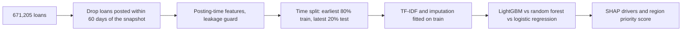

# Kiva Loans Microfinance Analytics

A funding-risk model on 671,205 Kiva microloans that scores each loan at posting time for the risk of never
being fully funded. Tested on the most recent 20% of loans, LightGBM reaches **PR-AUC 0.389** on the at-risk
class (base rate 4.6%) and catches **76%** of at-risk loans.

[](LICENSE)
[](#getting-started)
[](https://github.com/alvenyuka/Kiva-Loans-Microfinance-Analytics/actions/workflows/ci.yml)


## Overview

On Kiva, microfinance field partners post loans for small borrowers and lenders fund them in small amounts.
About 6% of loans with a known outcome never reach full funding, which can mean a missed planting season for
the borrower and a loan the field partner has to cover or cancel. Spotting those loans when they are posted
gives a platform or impact funder time to act, for example by featuring a loan or adding matching funds.

The project also asks the development-finance question behind it: are the poorest regions the ones left
unfunded? Loans are joined to Kiva's regional Multidimensional Poverty Index (MPI) to test that.

## Results

Held-out test set: the 129,017 most recently posted loans (after 27 Oct 2016), 5,957 of them not funded.

| Model | PR-AUC, at-risk class | ROC-AUC |
|---|---:|---:|
| **LightGBM** | **0.389** | 0.921 |
| Random forest | 0.284 | |
| Logistic regression | 0.237 | |

| LightGBM at the default threshold | Value |
|---|---:|
| Recall, at-risk loans caught | 76% |
| Precision, flagged loans truly at risk | 24% |
| Days-to-fund error for funded loans (MAE) | 7.0 days |

- **Loan structure drives funding risk.** Term, amount and posting month rank well ahead of borrower gender
  mix, sector and country.
- **The score is a screening tool.** It flags about four loans for each one truly at risk, which suits cheap,
  early support such as featuring a loan, not decisions that exclude borrowers.
- **Poverty data covers only 7.6% of loans** (50,955), because region names do not match the index cleanly.
  Within that subset, regions in Timor-Leste, Nigeria and Sierra Leone combine deep poverty with the lowest
  predicted funding; the ranking illustrates the method rather than a targeting list.

## Approach



1. **Settled outcomes only.** The funded rate falls from 94% to 16% for loans posted in the snapshot's final
   week, because they were still fundraising. Loans posted within 60 days of the snapshot (3.9%) are excluded.
2. **Posting-time features.** Funded time, lender count and funded amount exist only because a loan was
   funded, so a tested guard keeps them out, before and after encoding.
3. **Out-of-time evaluation.** Models train on loans posted up to 27 Oct 2016 and are scored on later ones;
   the TF-IDF vocabulary of each loan's stated purpose and the missing-value medians are fitted on the
   training period only.
4. **Model choice on the minority class**, since the funded majority scores well whatever the model does.
5. **Regional synthesis**: MPI multiplied by predicted funding risk, after dropping 94 region coordinates the
   upstream file places on the wrong continent.

## Repository structure

```
Kiva_Loans_Microfinance_Analytics.ipynb   the analysis, executed end to end
build_notebook.py                         generates the notebook (edit this, not the .ipynb)
src/features.py                           leakage guard, funding target, gender parsing
tests/                                    tests for the logic the results rest on
figs/                                     SHAP drivers and the funding-vs-poverty map
docs/METHODOLOGY.md                       full method, every result, limitations
```

## Getting started

```bash
pip install -r requirements.txt
python -m pytest              # no dataset needed
# put kiva_loans.csv and kiva_mpi_region_locations.csv in ./data (or set KIVA_DATA_DIR)
python build_notebook.py
jupyter nbconvert --to notebook --execute Kiva_Loans_Microfinance_Analytics.ipynb --output Kiva_Loans_Microfinance_Analytics.ipynb
```

The notebook takes about 15 minutes and needs roughly 2 GB of free memory.

## Notes

- Correlational only: nothing here shows that a factor causes funding success, and the poverty link is
  measured across regions, not individual borrowers.
- A few loans older than 60 days at the snapshot may still have been fundraising, so the at-risk class can
  hold a small residue of them.

## License

MIT. See [`LICENSE`](LICENSE). Data: [Data Science for Good: Kiva Crowdfunding](https://www.kaggle.com/datasets/kiva/data-science-for-good-kiva-crowdfunding) (Kaggle).

Alven Yuka · [LinkedIn](https://www.linkedin.com/in/alven-yuka-610b78174/) · [Email](mailto:alvenyuka2@gmail.com)
